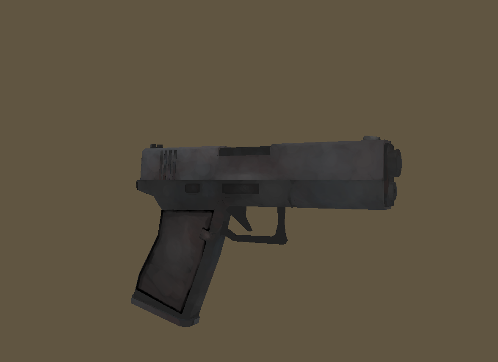
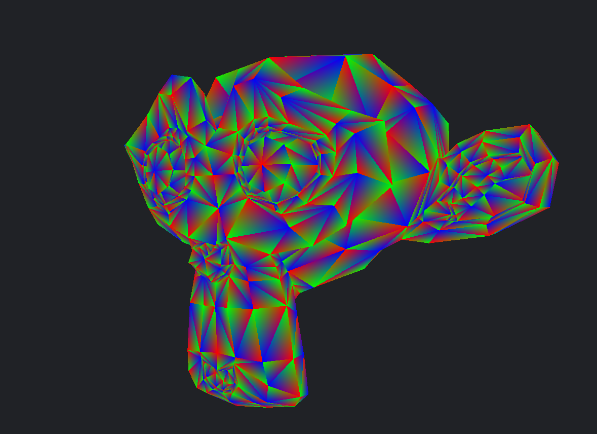
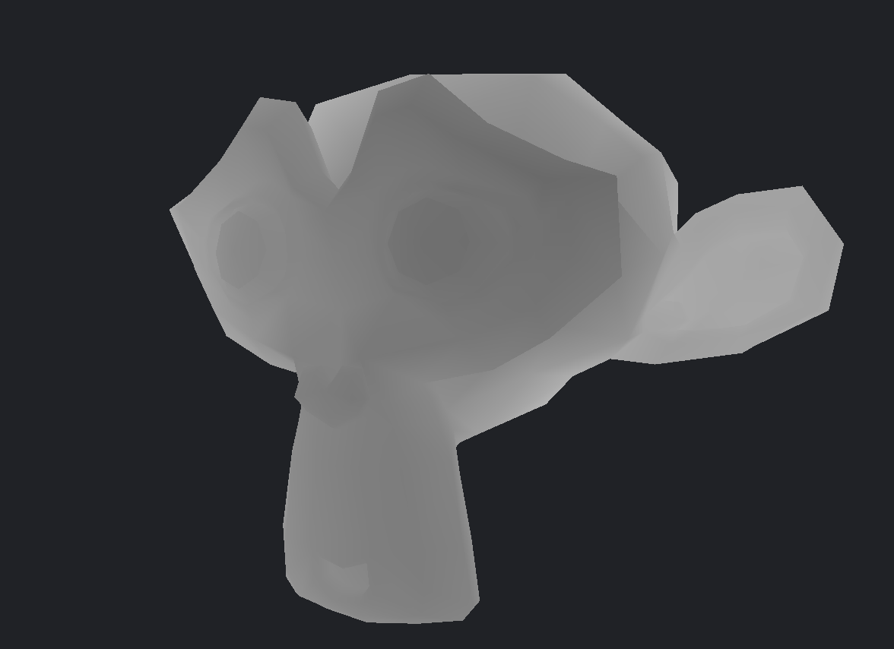

## Software rendered 3D game engine written in C99
Purely software rendered, no graphics APIs and no external dependencies.  

This project is currently in very early development, I've recently implemented triangle rasterization. I will refactor the codebase once some other fundamental features, such as triangle clipping, are finished.

## Images

### Texture mapping 

### Barycentric coordinates visualization 

### Depth buffer visualization

## Current engine goals
- Shading pipeline  
- 3D collision detection
- Asset system

## Game
The game I will be making with this engine is still undecided. But I have many ideas that I will begin prototyping once the engine has some more features like 3D physics and asset system. The engine goals will be updated after that based on what the game needs.

